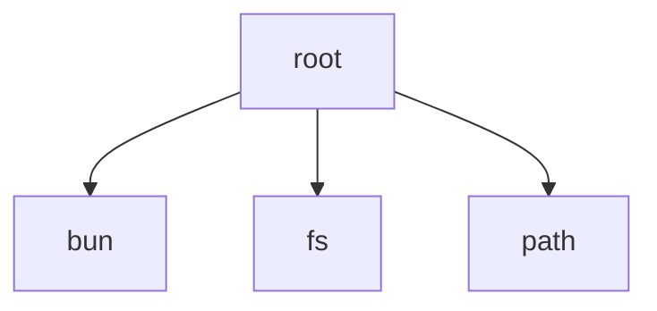

# Root Module

[← Back to INDEX](../../INDEX.md)

**Type:** root | **Files:** 36

## Files

| File | Lines | Large |
| ---- | ----- | ----- |
| `Quotio/QuotioApp.swift` | 606 | 📊 |
| `Quotio/Services/AgentConfigurationService.swift` | 1394 | 📊 |
| `Quotio/Services/AgentDetectionService.swift` | 252 |  |
| `Quotio/Services/AtomFeedUpdateService.swift` | 533 | 📊 |
| `Quotio/Services/CLIExecutor.swift` | 430 |  |
| `Quotio/Services/ChecksumVerifier.swift` | 78 |  |
| `Quotio/Services/CompatibilityChecker.swift` | 123 |  |
| `Quotio/Services/CustomProviderService.swift` | 335 |  |
| `Quotio/Services/DirectAuthFileService.swift` | 487 |  |
| `Quotio/Services/FallbackSettingsManager.swift` | 338 |  |
| `Quotio/Services/GLMQuotaFetcher.swift` | 186 |  |
| `Quotio/Services/ImageCacheService.swift` | 135 |  |
| `Quotio/Services/KeychainHelper.swift` | 167 |  |
| `Quotio/Services/LanguageManager.swift` | 116 |  |
| `Quotio/Services/LaunchAtLoginManager.swift` | 190 |  |
| `Quotio/Services/Logger.swift` | 124 |  |
| `Quotio/Services/ManagementAPIClient.swift` | 718 | 📊 |
| `Quotio/Services/NotificationManager.swift` | 327 |  |
| `Quotio/Services/Proxy/CLIProxyManager.swift` | 1839 | 📊 |
| `Quotio/Services/Proxy/FallbackFormatConverter.swift` | 109 |  |
| `Quotio/Services/Proxy/ProxyBridge.swift` | 1092 | 📊 |
| `Quotio/Services/Proxy/ProxyStorageManager.swift` | 403 |  |
| `Quotio/Services/ProxyConfigurationService.swift` | 96 |  |
| `Quotio/Services/RequestTracker.swift` | 193 |  |
| `Quotio/Services/ShellProfileManager.swift` | 121 |  |
| `Quotio/Services/StatusBarManager.swift` | 245 |  |
| `Quotio/Services/StatusBarMenuBuilder.swift` | 1448 | 📊 |
| `Quotio/Services/Tunnel/CloudflaredService.swift` | 266 |  |
| `Quotio/Services/Tunnel/TunnelManager.swift` | 184 |  |
| `Quotio/Services/UpdaterService.swift` | 169 |  |
| `Quotio/Services/WarmupService.swift` | 183 |  |
| `Quotio/Services/WarpService.swift` | 84 |  |
| `Quotio/ViewModels/AgentSetupViewModel.swift` | 436 |  |
| `Quotio/ViewModels/LogsViewModel.swift` | 82 |  |
| `Quotio/ViewModels/QuotaViewModel.swift` | 1825 | 📊 |
| `scripts/capture-screenshots.ts` | 763 | 📊 |

## Documentation

- [outline.md](outline.md) - Symbol maps for large files
- [memory.md](memory.md) - Warnings and TODOs

---

## External Dependencies

Dependencies from other modules:

- `bun`
- `fs`
- `path`
